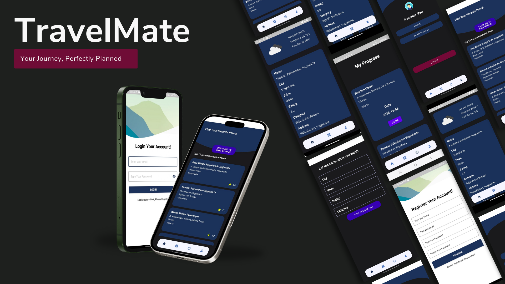
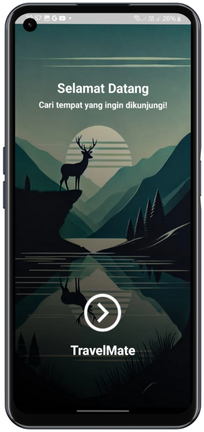
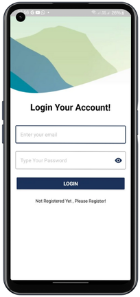
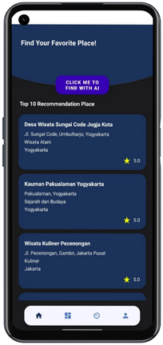
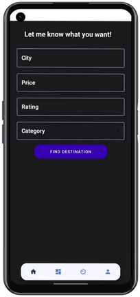
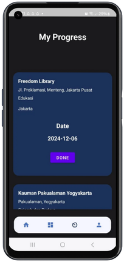
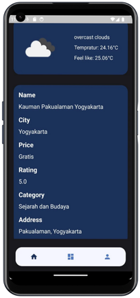
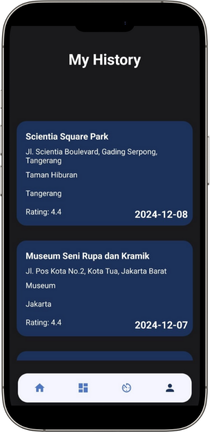
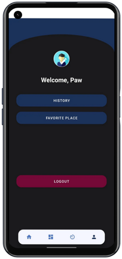

# Profile
## Team ID : C242-PS513
### Members
- M744B4KY2667 – [Muhamad Wahyu Ramdan](https://www.linkedin.com/in/wahyuramdan04)
- M744B4KX4172 – [Siti Munawaroh](http://www.linkedin.com/in/sitimunawaroh86)
- M728B4KY4559 – [Yudhi Septian](https://www.linkedin.com/in/yudhi-septian-9608501b6)
- C318B4KY0018 – [Abdul Aziz](https://www.linkedin.com/in/abdul-aziz-5ab0a920a/)
- C318B4KY3819 – [Ridho Abdul Aziz](https://www.linkedin.com/in/ridho-abdul-aziz-509b43303/)
- A318B4KY1120 – [Dicky Saputra](https://www.linkedin.com/in/dickysaputraa/)

# Aplication Overview
## Background 
In the advancing digital era, tourism has become one of the most rapidly growing sectors, capturing the attention of people worldwide. However, many travelers often face challenges in finding recommendations for tourist destinations that match their preferences, especially in a country as rich in destinations as Indonesia. Information scattered across various platforms is often disorganized and lacks personalization, leaving travelers feeling confused or dissatisfied with the available options.
To address this issue, Travel Mate was developed as a solution. This application is designed to provide relevant and personalized recommendations for tourist destinations by leveraging cutting-edge technologies such as machine learning and structured databases. Additionally, features like date-based notifications and weather integration aim to enhance the user experience.
The main goal of Travel Mate is to help travelers plan their trips more easily, effectively, and enjoyably. By integrating accurate information and intelligent features, this application aspires to become a reliable companion for every traveler

## Learning Path
- [Cloud Computing](https://github.com/RidhoAbaaz/travelmate/tree/0df8a23009b9f73a3f8001bcb1cb023b6addeaac/Cloud%20Computing)
- [Machine Learning](https://github.com/RidhoAbaaz/travelmate/tree/0df8a23009b9f73a3f8001bcb1cb023b6addeaac/Machine%20Learning)
- [Mobile Development]()
  
## Application feature
- Tourist Recommendations: Provide recommendations for tourist destinations based on user preferences.
- Weather Integration: Offer weather information at tourist locations.
- Date Notifications: Remind users about travel schedules or related events.
  
## Requirement
- Android Studio (Android SDK)
- Android Device or Android Emulator
- Emulator / External Device
- USB Cable (connect application to mobile device)

## UI/UX Application
<div>
    
    
    
</div>
<div>
    
    
    
</div>
<div>
    
    
    
</div>

## Installation
### Install from repository
1. clone this project to your computer
  ```bash
  git clone https://github.com/RidhoAbaaz/travelmate.git
 ```

or clone in Android Studio  
File > New > Project From Version Control

2. Open Android Studio and select Mobile Development Folder
3. Run Project in Adroid Studio  
   Wait for Gradle Build to Finish and finally press the Run > Run ‘app’. Now the app has been installed in your phone / emulator. Make sure that you have configured your android device or emulator

### Install from APK file
1. dowload APK from 
2. install in your phone

# Thank You

